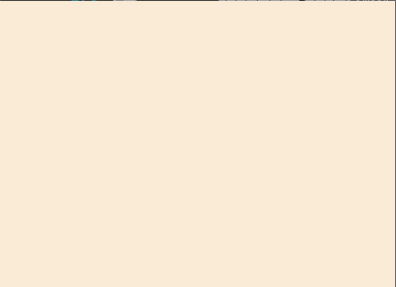
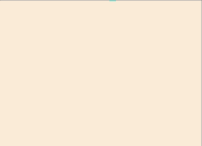

# PyFallingSand

<!-- TODO: Create an animated gif of the project running -->


## Overview
This is a simple simulation application built with Python and the NumPy and Tkinter libraries that allows users to interactively create and observe the behavior of falling sand particles within a 2D grid.

This project is an educational practice with Cellular Automata to create a particle simulation

## Features
### Particles
#### Sand

- The initial particle in this system.
- Sand will fall down with gravity
- Sand will slide down itself and form piles of sand particles
- Sand is heavier than water and will push up any water particles it encounters

#### Water

- Water will fall down with gravity
- Water tries to fill available space so it will slide side to side and level out
- Water douses any fire it falls on top of

#### Stone
]
- Solid, stationary, and indestructible(so far)
- Stone is unaffected by gravity

#### Wood
]
- Solid, stationary, and flammable
- Wood is unaffected by gravity

#### Air

- Everything else(so far)
- If it's not a particle listed above, it's air

### Planned Features
#### WIP Particles
- Fire Particles
	- will have it spread at random intervals to nearby flammable particles
	- it will need nearby air to survive and spread
	- converts WOOD into BURNT_WOOD
- Burnt Wood into
	- the state of a wood particle that is being consumed by a fire particle
	- burnt wood will turn nearby air particles into smoke particles
	- burnt wood will be destroyed when it is on fire for a random amount of time
- Smoke
	- Created by the burnt wood particle
	- floats upward, moving left and right
	- smoke particles will die over time
- Particle Generators
	- Create generators of a specified particle type that continuously generate those particles
#### WIP Physics
- Updating the water displacement logic
	- I want to water to shift to the left/right when being displaced by a tall tower of sand
#### WIP UI Features
- Updating menu bar
	- moving particle selection either to icon buttons or have them directly on the menu bar instead of a dropdown menu
- Slider to control particle brush size
- Keyboard shortcuts for saving/loading/new scene controls
- keyboard/mouse shortcuts for changing particle type

## Requirements
Make sure you have the following dependencies installed before running the application:
- Python 3.X
- tkinter 8.X (install using `pip install tk`)
- numpy 1.26.X (install using `pip install numpy`)

## Usage
1. Clone the repository:

	```bash
	git clone https://github.com/JDCrawf/PyFallingSand.git
	```

2. Navigate to the project directory:

	```bash
	cd PyFallingSand
	```

3. Launch the PyFallingSand application

    ```bash
    py PyFallingSand.py
	```
	or
	```bash
	python PyFallingSand.py
	```
	or
	```bash
	python3 PyFallingSand.py
    ```

4. Have fun painting particles into the simulation

## Contributing
If you would like to contribute to this project, feel free to fork the repository and submit a pull request. Any contributions are welcome and accepted push requests will get your name added to this list!

Jacob Crawford - [@JDCrawf](https://github.com/JDCrawf)

## License
- This project is licensed under the [MIT License](LICENSE).
- Tkinter: Python Software Foundation License (included with Python installations).
- Numpy: Modified BSD License.  See [NumPy License](https://github.com/numpy/numpy/blob/main/LICENSE.txt) for details

## Acknowledgments
- Thanks to the Tkinter and NumPy communities for providing excellent libraries and resources.
